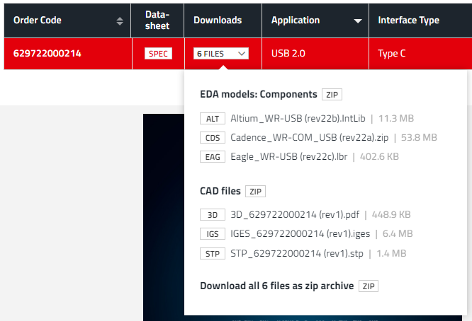

# Hardware related documentation

## Libs used in design

Here I'll be adding all libraries that i have used in schematics and as i am not owner of any of them, I'll just link'em.

### USB-C port

Imported from [Würth Elektronik website under Order Code `629722000214`](https://www.we-online.com/en/components/products/WR-COM_USB_20_TYPE_C_RECEPTACLE_HORIZONTAL_SMT#629722000214)  

